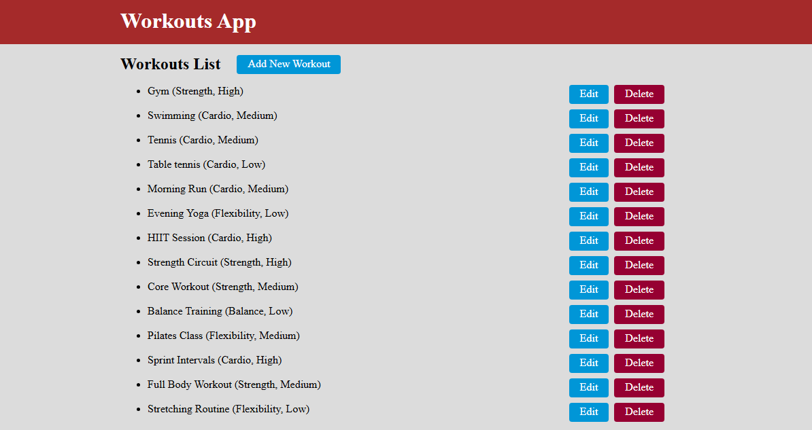
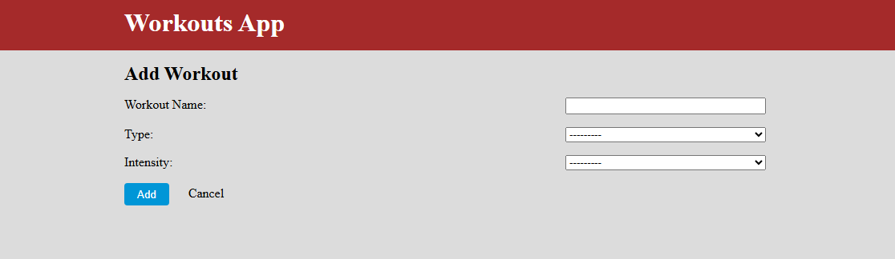
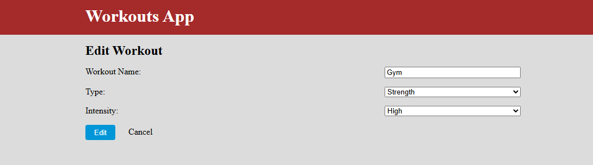

# System organizacji treningów fitness - Workouts App

## Spis treści

1. [Opis projektu](#opis-projektu)
2. [Zaimplementowane funkcjonalności](#zaimplementowane-funkcjonalności)
3. [Instrukcja obsługi](#instrukcja-obsługi)

---

## Opis projektu

System organizacji treningów fitness to prosta aplikacja webowa stworzona w **Django**, umożliwiająca zarządzanie
treningami: dodawanie, edycję, usuwanie i przeglądanie listy treningów z uwzględnieniem rodzaju oraz intensywności.

Projekt zrealizowano w ramach zaliczenia kursu programowania aplikacji webowych, zgodnie z architekturą **MVC** i
konwencją **Django**.

---

## Zaimplementowane funkcjonalności:

- **Workout** - model zawierający pola: `name`, `workout_type`, `intensity`
- **Migracja `0002_add_example_workouts.py`** – dodaje 10 przykładowych rekordów treningów do bazy danych
- **Zastosowanie architektury MVC**:
    - *Model* – definicja danych (`workouts/models.py`)
    - *View* – szablony HTML (`workouts/templates/`) do renderowania interfejsu
    - *Controller* – logika i obsługa żądań (`workouts/views.py`)

### Widoki:

**Lista treningów** – wyświetlenie wszystkich dodanych pozycji z opcją edycji i usunięcia



**Dodawanie treningu** – formularz umożliwiający dodanie nowego wpisu



**Edycja treningu** – formularz z uzupełnionymi danymi do edycji istniejącego wpisu



**Usuwanie treningu** – możliwość usunięcia wpisu z potwierdzeniem


---

## Instrukcja obsługi

Aby uruchomić aplikację lokalnie, należy utworzyć i aktywować środowisko wirtualne, a następnie zainstalować wymagane
pakiety za pomocą pliku `requirements.txt` oraz wykonać migracje bazy danych. Po tych krokach można uruchomić serwer
deweloperski i korzystać z aplikacji przez przeglądarkę.

Tworzenie wirtualnego środowiska:

```bash
python3 -m venv .venv
````

Aktywacja środowiska wirtualnego:

```bash
source .venv/bin/activate
```

Instalacja wymaganych pakietów z pliku `requirements.txt`:

```bash
pip install -r requirements.txt
```

Wykonanie migracji bazy danych (utworzenie tabel i danych przykładowych):

```bash
python3 manage.py migrate
```

Uruchomienie serwera deweloperskiego:

```bash
python3 manage.py runserver
```
